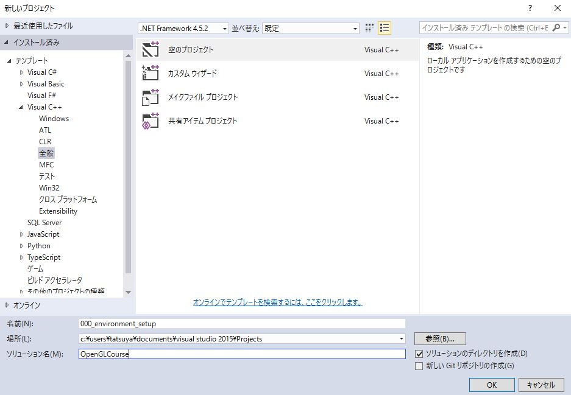
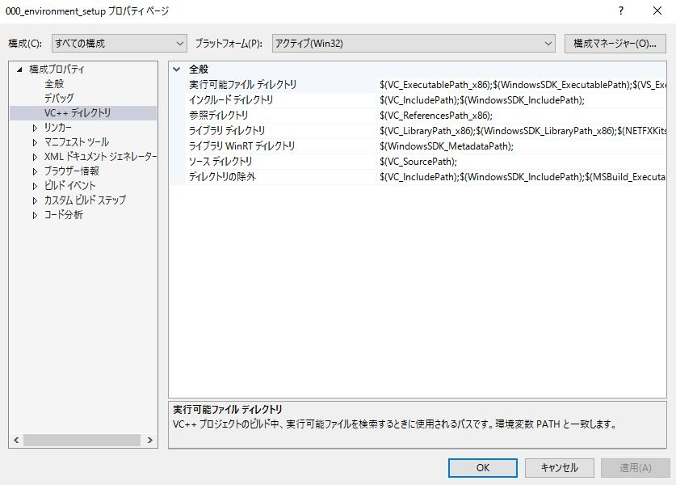
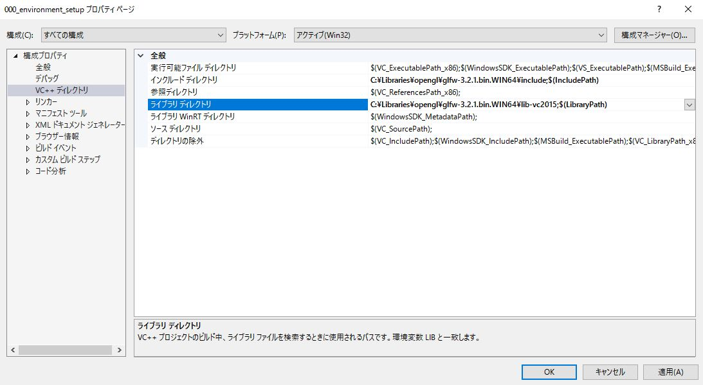
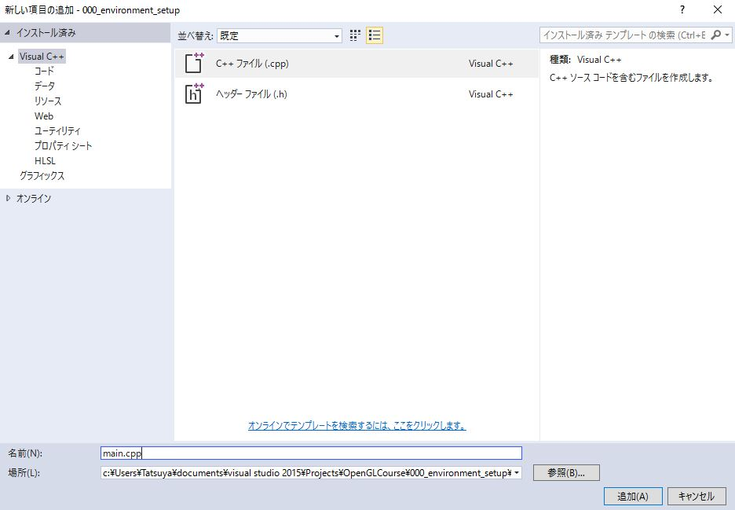

第0回 環境設定
===

このコースではOpenGLを利用するためにGLFW(OpenGL Frameworkの略)というライブラリを使用します。
以下では、WindowsとMacOSでの開発環境の設定方法についてご紹介します。

## Windowsの場合

#### Visual Stuidoのインストール
Windowsの場合にはVisual Studioを使うことをお勧めします。
Visual Studioは現在Community版が無料で使用可能なので、そちらを利用します。

**Visual Studioのダウンロードページ**  
[https://www.visualstudio.com/ja/downloads/](https://www.visualstudio.com/ja/downloads/)

こちらからファイルをダウンロード後、インストーラを実行します。
注意点として、開発に用いるプログラミング言語であるC++は、現在の初期設定では
使用できないようになっているので、必要なコンポーネントでVisual C++にチェックを入れます。

#### GLFWのインストール

GLFWの公式ページからコンパイル済みのライブラリをダウンロードします。

**GLFWのダウンロードページ**  
[http://www.glfw.org/download.html](http://www.glfw.org/download.html)

上記のウェブページを開いて、中央にある「Windows pre-compiled binaries」から、
ライブラリをダウンロードします。こちらには32bitのものと64bitのものがありますが、
現在のコンピュータであれば、おおよそ64bitのものをダウンロードすれば大丈夫だと思います。

ダウンロードが完了したら、これを適当なディレクトリに配置します。標準的には、
```C:\Libraries\opengl```のようなディレクトリを作成して、その中に置くのが良いかと思います。

#### Visual Studioプロジェクトの作成

ここまで設定が完了したら、実際にVisual Studioでサンプルプログラムをビルドします。
まずVisual Studioを開いて「スタートページ」から「新しいプロジェクト...」をクリックします。

そこで「空のプロジェクト」を選択し、プロジェクト名、およびソリューション名を入力します。
ここでプロジェクト名を入力するとソリューション名も、それに合わせて変更されますが、
これらは必ずしも同じである必要はありません。

今後もこのソリューションを使うことを考えて、プロジェクト名は「000_environment_setup」、
ソリューション名は「OpenGLCourse」などにしておくと良いかと思います。



#### GLFWを使うためのプロジェクト設定

GLFWを使用するためには、プロジェクトの設定をする必要があります。設定する箇所は3か所です。

まず「ソリューションエクスプローラー」からプロジェクト名「000_environment_setup」を右クリックし、
一番下にある「プロパティ」を選びます。そうすると「000_environment_setupのプロパティページ」という
ウィンドウが出てくると思います。

この画面が出たら、左上にある「構成(C)」というドロップダウンメニューから「すべての構成」を選びます。



続いて、画面左側の「構成プロパティ」から「VC++ディレクトリ」を選び、
「インクルードディレクトリ」および「ライブラリディレクトリ」に以下の文字列を追加します。

**インクルードディレクトリ**  
C:\Libraries\opengl\glfw-3.2.1.bin.WIN64\include

**ライブラリディレクトリ**  
C:\Libraries\opengl\glfw-3.2.1.bin.WIN64\lib-vc2015



最後に、「構成プロパティ」の「リンカー」から「入力」を選びます。その一番上にある
「追加の依存ファイル」に次の文字列を追加します。

**追加の依存ファイル**  
glfw3.lib

以上で設定は完了です。プロパティページ下側にある「OK」を押して、ウィンドウを閉じます。

#### サンプルプログラムのビルド

プログラムを作成するためにはソースコードを書く必要があります。ソースコードは「000_environment_setup」内の
「ソースファイル」というフォルダのアイコンを右クリックして、「追加」→「新しい項目」の順で追加します。

そうすると「新しい項目の追加」というウィンドウが表れるので、そのウィンドウで「C++ファイル」を選び、
名前を「main.cpp」に変更して「追加(A)」ボタンをクリックします。



作成されたファイルを開き、以下のソースコードを入力します。内容に関しては、後の章で解説をします。

```cpp
#include <cstdio>
#include <GLFW/glfw3.h>

int main(int argc, char **argv) {
    if (glfwInit() == GL_FALSE) {
        fprintf(stderr, "Initialization failed!\n");
        return 1;
    }
}
```

特に問題がなければ、「Ctrl+Shift+B」を押すことでビルドが成功するはずです。

プログラムは「Ctrl+F5」で実行できますが、今回のプログラムは何も起こらずに終了します。

## MacOSの場合

To be appeared...
